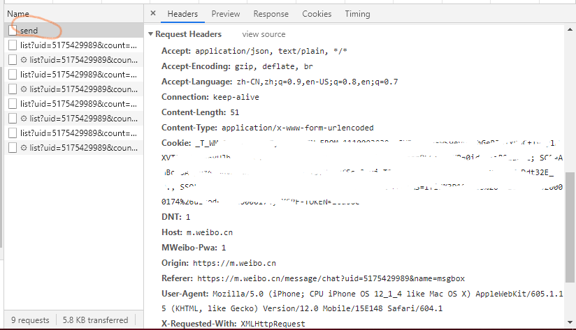
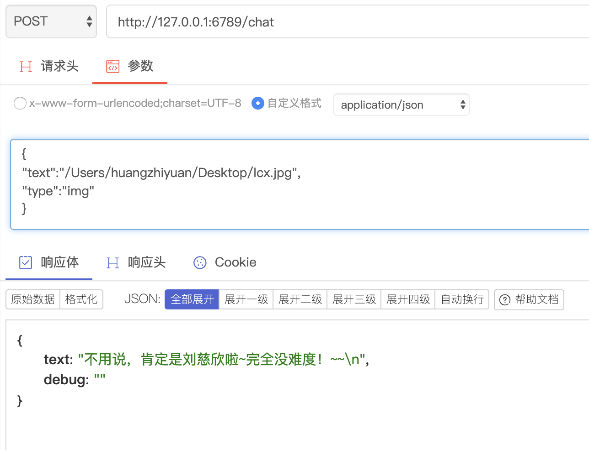

# realXiaoice
真正唯一可用的微软小冰API

来源为新浪微博

# 环境
Python 3.5+

# 依赖
* tornado
* requests

# 使用方法
## 1. 领养小冰 
注册一个新浪微博账号，领养小冰，确保与小冰的私信是正常的
## 2. 登录微博账号
使用Chrome或者Firefox，建议开启隐身模式，打开 [https://m.weibo.cn](https://m.weibo.cn)， 登录你的微博账号
## 3. 获取headers
打开和小冰的私信页面，按F12打开控制台，切换到Network，并选中XHR，然后和小冰说句话，点开名为send的请求

复制全部Request Headers中**除了Content-Length以外所有行**，粘贴到headers.txt中
**请注意headers.txt的格式，注意大小写,`Cookie`和`X-XSRF-TOKEN`需要大写**


## 4. 安装Python 3与依赖
安装适合自己平台的Python，需要3.5+之后的版本。为了后续兼容性考虑，选择3.6或3.7吧。然后
```bash
pip install tornado requests
``` 

## 5. 运行
```bash
python ice_server.py
```
## 6. systemd
```unit file (systemd)
[Unit]
Description=xiaoice API by Benny
After=network.target network-online.target nss-lookup.target

[Service]
User=nobody
Restart=on-failure
Type=simple

WorkingDirectory=/path/to/realXiaoice
ExecStart=/usr/bin/python3 /path/to/realXiaoice/ice_server.py

[Install]
WantedBy=multi-user.target

```

# API
## 请求格式
接受GET、POST url-encoded-data和POST json，示例如下：

对于文字
```http request

# curl http://127.0.0.1:6789/chat?text=hello&type=text
GET http://127.0.0.1:6789/chat?text=hello&type=text

###


POST http://127.0.0.1:6789/chat
Content-Type: application/json

{
  "text": "what",
  "type":"text"
}


###


# curl -d 'text=hi&type=text' http://127.0.0.1:6789/chat
POST http://127.0.0.1:6789/chat
Content-Type: application/x-www-form-urlencoded

text=hi
type=text

###

```

对于图片(暂时只支持jpg)

```http request

# curl http://127.0.0.1:6789/chat?text=/tmp/test.jpg&type=img
GET http://127.0.0.1:6789/chat?text=/tmp/test.jpg&type=img

###


POST http://127.0.0.1:6789/chat
Content-Type: application/json

{
  "text": "/tmp/test.jpg",
  "type":"img"
}


###


# curl -d "text=/tmp/test.jpg&typt=img" http://127.0.0.1:6789/chat
POST http://127.0.0.1:6789/chat
Content-Type: application/x-www-form-urlencoded

text=/tmp/test.jpg
type=img

###

```

更多详情请参考 [api.http](api.http)


## 响应格式
### 成功
HTTP 200
```json
{
    "text": "想我干嘛",
    "debug": ""
}
```
### 参数错误
HTTP 400
```json
{
    "text": "",
    "debug": "client wrong reason"
}
```
### 服务端错误
HTTP 500
```json
{
    "text": "",
    "debug": "server wrong reason"
}
```


# 效果图




# 附加功能
## IP地址访问限制
默认关闭，只允许某几个IP访问可以使用如下方式
```bash
python ice_server.py -a=127.0.0.1,1.1.1.1
```
## 授权码限制
默认关闭，编辑`key.txt`一行一个添加授权码，或者运行`keygen.py`自动生成
开启方式
```bash
python ice_server --auth
```
请求时需要在参数中携带auth，例如：
```bash
curl http://127.0.0.1/chat?text=hello&auth=123456
```

# Credits
* https://github.com/yanwii/msxiaoiceapi
* [BelinChung](https://github.com/BelinChung)
* [mgsky1](https://github.com/mgsky1)

# License
MIT
